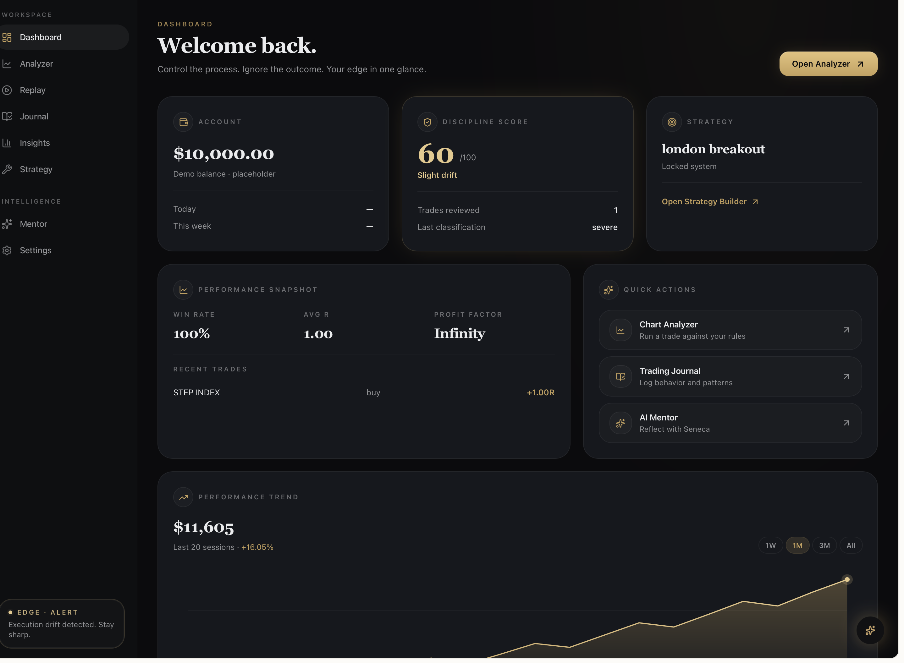
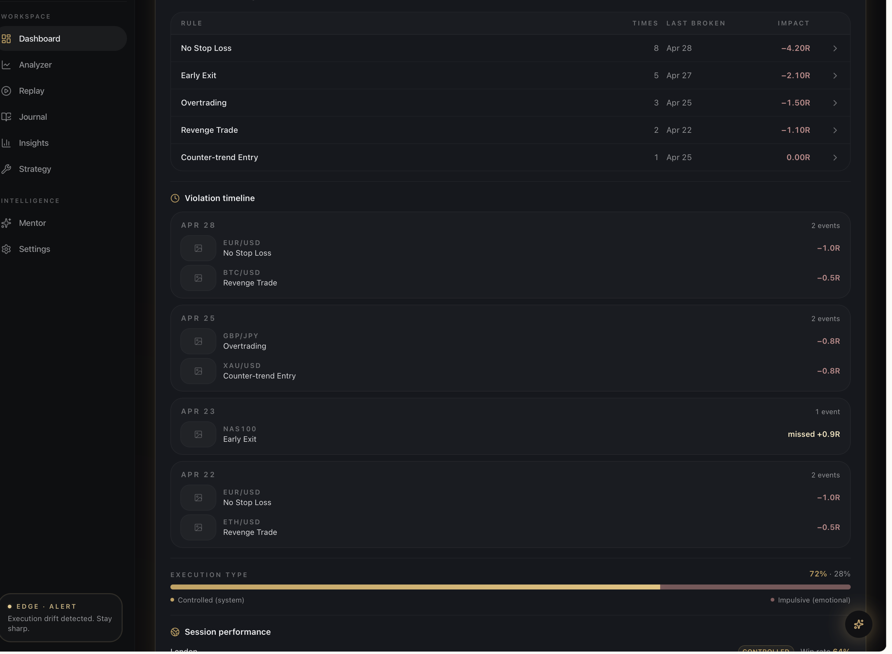
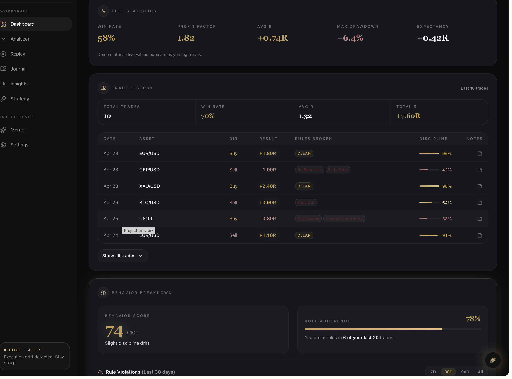

# Seneca Edge
Trade with clarity. Execute with discipline. Improve with data.
Seneca Edge is a trading platform focused on disciplined execution, structured reflection, and realistic simulation.

It focuses on one core problem:
most traders don’t fail because of strategy — they fail because of inconsistent decision-making.

Seneca Edge is built to solve that.

## Product Preview

---

### 🧭 Dashboard (Control Layer)

Control your entire trading process in one place. Monitor discipline, track performance, and stay aligned with your system at a glance.

---
### 🧠 Behavior & Discipline Tracking

Track execution errors, identify repeated mistakes, and build awareness of your trading behavior over time.

---

### 📊 Trade History & Performance

Review every trade with full context. Analyze outcomes, consistency, and long-term performance trends.

## How It Works

Seneca Edge is built around a simple loop:

### 1. Replay & Observe
Traders replay historical market data candle-by-candle to simulate real conditions. This removes hindsight bias and forces real-time decision-making.

### 2. Execute & Simulate
Trades are placed inside the simulation engine using defined risk parameters (stop loss, take profit, position sizing). Every action is tracked.

### 3. Journal & Reflect
Each trade is logged with structured reflection. Seneca Edge supports journaling for both simulated trades (from replay sessions) and externally executed trades (e.g., MT5). Traders record reasoning, execution quality, and emotional context.

### 4. Analyze Behavior
The system identifies recurring patterns such as overtrading, early exits, or rule violations.

### 5. Improve Decision-Making
Insights are used to refine execution, reinforce discipline, and build consistency over time.

---

The goal is not just better trades —  
it is better decisions, repeated consistently.

---
⸻

## Overview

Seneca Edge provides a structured environment where traders can:

Replay historical market data bar-by-bar
Simulate trades under realistic conditions
Journal decisions with structured reflection
Analyze behavioral patterns over time

The platform shifts trading from intuition-driven actions to measurable, repeatable decision-making.

⸻

## Core Features

### 🔁 Replay Engine

Candle-by-candle playback with adjustable speed (0.5x to 4x)
Precise reconstruction of historical price action
Supports session-based simulation across instruments

### 📊 Trade Simulator

Market Buy/Sell execution with Stop Loss and Take Profit
Risk-based position sizing (% of account)
Real-time trade tracking with outcome logging

### 📈 Performance Analytics

Equity curve tracking
Win rate and R-multiple analysis
Full trade history breakdown

### 🧠 Decision & Behavior System

Trade Journal

Structured logging for every trade
Post-trade reflection and mistake tagging
Behavioral pattern tracking over time

AI Mentor (In Development)

Personalized feedback on execution quality
Detection of recurring behavioral errors
Reinforcement of rule-based trading discipline

⸻

## Data Integration

- Synthetic indices via Deriv API  
- Forex data integration supported via external APIs  
- Structured asset classification (Synthetic / Forex)

## Architecture

| Layer | Technology |
|------|------------|
| Chart Engine | TradingView Advanced Charts Library |
| Backend & Auth | Supabase (Edge Functions, Postgres) |
| AI Pipeline | Gemini 2.5 Flash + GPT-5 Mini (fallback) |
| Replay Engine | Custom candle streaming system (Deno / Supabase Edge Runtime) 

The AI system uses a multi-layer validation pipeline:

* Primary data extraction
* Confidence scoring
* Fallback logic

This ensures outputs are grounded in actual data — not generated assumptions.

⸻

## Vision

To build a trading environment that prioritizes:

Clarity
A clean, distraction-free interface focused on decision-making

Discipline
Structured workflows that enforce consistency

Realistic Simulation
Market conditions that closely mirror live execution

## Project Status

| Module | Status |
|--------|--------|
| Replay Engine | Complete |
| Trade Simulator | Functional |
| Trade Journal | Live |
| Performance Analytics | Live |
| Forex Data Integration | In Progress |
| AI Mentor | In Development |
| TradingView Chart Integration | In Progress |

## Integration & Collaboration

Seneca Edge is actively seeking integration with the TradingView Advanced Charts Library to enhance its replay and simulation capabilities.

The platform is designed to complement professional trading workflows and aligns with TradingView’s mission of providing powerful tools for traders.

For collaboration or integration discussions, please open an issue on GitHub.
License

MIT © solexkuti

